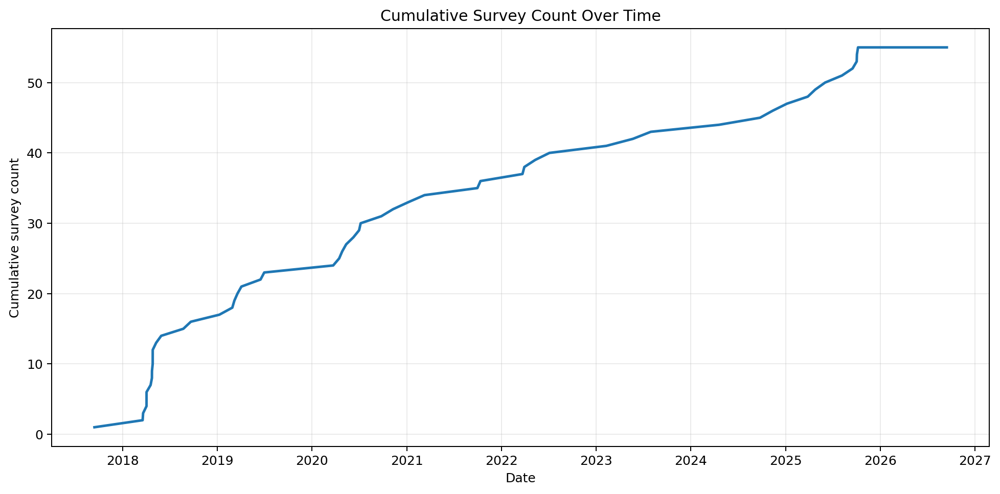
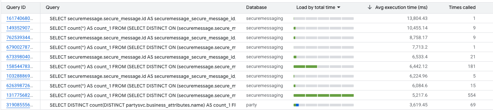
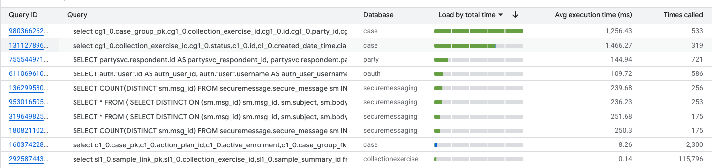
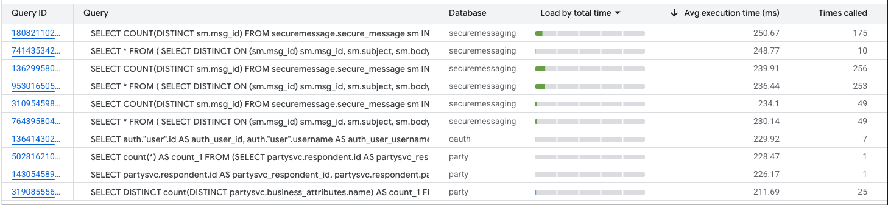

# Secure Message – Performance Review

## History

Secure Message was first developed on 11th May 2017, with the first external message sent at 9:40am on 20th September 2017 for BRES, which had a sample size of 693.

At the time, there were no established SLAs and little understanding of the potential volume or load the service would ultimately need to support. The service was developed internally by QA graduates, managed by two senior QA consultants.

For the remainder of 2017, Secure Message handled an average of 331 messages per month, including both internal and external messages.

---

## Growth

It was not until the 19th March 2018 that a second survey began using Secure Message. By the end of 2018, this had grown to 16 surveys, with the average monthly message volume increasing to 1,560.

Fast forward to today and the scale of the service has grown significantly. Secure Message now receives messages from 54 different survey and handles an average of 29,286 messages per month.

### Survey Growth

### Message Growth

| Year  | Total messages | Average per month |
|-------|---------------:| ---: |
| 2017  |          1,324 | **331** |
| 2018  |         18,719 | **1,560** |
| 2019  |        116,997 | **9,750** |
| 2020  |        153,953 | **12,829** |
| 2021  |        189,618 | **15,802** |
| 2022  |        197,692 | **16,474** |
| 2023  |        243,004 | **20,250** |
| 2024  |        225,378 | **18,782** |
| 2025  |        270,084 | **22,507** |
| 2026  |        234,285 | **29,286** |

---

## Issues and Performance 

Fundamentally, the underlying data model is not well suited to the way Secure Message is now being used.

Message data is split across multiple tables, meaning that even relatively simple operations can require several tables to be joined together. As the volume of messages has increased, this has become an increasingly significant performance issue.

The three main tables are:

- **Secure Message** – contains the details relating to an individual message.
- **Conversation** – acts as the container for all messages belonging to a conversation, including the original message and subsequent replies.
- **Status** – records information about the message, including who sent it, when it was sent and its read status.

With the substantial increase in message volumes since the service was originally designed, these joins now operate over much larger datasets and can result in increasingly expensive database queries.

On average, a complete conversation between an internal and external respondent contains approximately **2.6 Secure Messages** and generates **5.67 entries in the Status table**.

The impact is particularly noticeable for an internal inbox, where a user can have multiple conversations with many different external respondents. Retrieving and displaying the inbox can therefore require large numbers of records across the Conversation, Secure Message and Status tables to be combined.

For an external respondent, the impact is considerably smaller because they will typically have only a single conversation, or a relatively small number of conversations, to retrieve. As a result, the same underlying data model creates a much greater performance challenge internally than it does externally.

---

## Database Load

In early 2026, the image below shows the top 10 queries generating the greatest database load across the system.

The data was captured from one hour of normal system usage using GCP Query Analyser.

Importantly, this analysis covers the **entire system**, not just Secure Message.

The level of database load generated by Secure Message was therefore significantly out of balance with what would be expected, particularly when compared with other major application such as the Party and Case services.

At this point, the average execution time for Secure Message queries was approximately **5.67 seconds**. This represents database query execution time only and does not include application processing or server response time, meaning the actual wait experienced by users would be longer.

For users with particularly large numbers of messages in their inbox, performance could be considerably worse, with waits of **20 seconds or more** and occasional timeouts.

Secure Message was also responsible for approximately **70% of database CPU usage**. Although this did not cause the wider system to fail, it was a serious concern, particularly as database CPU utilisation would periodically reach 100%.

The combination of increasing message volumes, expensive queries and an inefficient underlying data model meant that the performance of Secure Message was becoming an increasing risk to both the service itself and the wider system.

---

# Steps Taken to Improve Performance

## Secure Message V2

By 2023, the limitations of the existing Secure Message architecture were fully recognised, and development of **Secure Message Version 2** began on 22nd March 2023.

The intention was not only to address the limitations of the existing data model, which needed to be fundamentally redesigned to support the increased load, but also to deliver a significant number of additional requirements requested by the business.

However, development was stopped on 27th November 2024 after 53 pull requests had been completed.

The V2 repository remains in good health and has continued to be maintained. The new data model has been implemented and basic API controls are in place, but it remains a considerable distance from being a complete replacement for the existing service.

Fundamentally, the team did not have the resources or time required to complete the work.

---

## Pivoting Away from V2

Following the decision to move away from developing V2, the focus shifted towards optimising the existing Secure Message service.

Although changing the underlying data model was no longer practical, there were still opportunities to substantially improve performance.

Two main areas were identified:

1. **Reduce the amount of historical data held in the system.**
2. **Optimise the existing database queries and joins.**

---

## 1. Reducing the Amount of Data

Historically, no Secure Message data had ever been deleted.

Internal users could close a conversation, but the conversation and all associated Secure Message and Status records remained permanently in the database.

Before the deletion process was introduced, the system contained approximately:

| Record type | Records |
| --- | ---: |
| Conversations | ~580,000 |
| Secure Messages | ~1.5 million |
| Status records | ~3.3 million |

Combined with the inefficient queries and joins, this volume of historical data was causing considerable performance issues.

### Automatic Deletion

On 24th March 2026, a process was implemented to automatically delete conversations that had been closed for more than 30 days.

As part of the initial clean-up, a significant volume of historical data was removed:

| | Conversations | Secure Messages | Status Records |
| --- | ---: | ---: | ---: |
| **Deleted** | 551,760 | 1,457,545 | 3,131,431 |
| **Remaining** | 29,349 | 76,339 | 169,854 |

The results were largely positive. Removing closed conversations produced a noticeable performance improvement for internal users with low- to medium-volume inboxes.

However, significant performance issues remained for users with particularly large inboxes, demonstrating that reducing the volume of data alone did not address the underlying query and data-model issues.

---

## 2. Optimising Queries and Joins

The design of some of the existing queries and joins was particularly inefficient.

Although the volume of data was contributing to the problem, the way that data was being queried was ultimately a more significant performance issue.

On 15 June 2026, extensive optimisation work was carried out on the database queries and joins used by Secure Message.

This resulted in a substantial further improvement in performance, with the greatest benefit seen for users with large inboxes.

# Results

The overall improvement has been very significant. The average Secure Message query execution time has reduced from  **5.67 seconds to 0.24 seconds**, representing a **95.8% reduction in execution time** and making the queries approximately **24 times faster**.

| Metric                           | Before | After |
|----------------------------------| ---: | ---: |
| Requests                         | 796 | 792 |
| Average execution time (seconds) | **5.67 sec** | **0.24 sec** |
| Performance reduction            | | **95.8%** |

### Before Optimisation

### After Optimisation

---

## Database CPU Usage

The improvement can also be seen in overall database CPU usage.

Before the changes, Secure Message was responsible for approximately **70% of database CPU usage**.

Following the deletion of historical conversations and optimisation of the queries and joins, Secure Message now accounts for approximately **20% of total database CPU usage**.

This is a substantial reduction and means Secure Message is no longer disproportionately consuming database resources compared with the other services sharing the Cloud SQL instance.

### Before Optimisation

### After Optimisation

This graph also illustrates the impact of the two changes. Following the conversation deletion process, there was a noticeable improvement in performance, although issues were still evident, particularly for users with larger inboxes.

Following the query optimisation work, performance improved significantly further, with the most noticeable improvement seen for the higher-volume inboxes that had previously experienced the longest response times.

---

# Business case for using secure Message going forward
This document was created to assess how Secure Message is currently being used and whether following the performance improvements already made, there are any remaining risks to the service.

The next section will consider the cost of running Secure Message following these changes, the potential of scaling the existing service, and how future development of Secure Message should be approached

# Costs

Secure Message shares infrastructure with several other applications, so calculating its exact infrastructure cost is difficult. The figures below therefore represent a reasonable estimate based on its proportion of shared resource usage.

## Production

The production Cloud SQL instance has:

- **10 vCPUs**
- **32 GB RAM**
- **200 GB SSD**
- **High Availability**

The instance is shared across multiple applications and costs approximately **£1000 per month**.

Secure Message after the changes above accounts for approximately **20% of database CPU usage**. 

| Cost | Basis                                                         | Estimated monthly cost |
| --- |---------------------------------------------------------------|-----------------------:|
| Cloud SQL | 20% of £1000 shared instance                                  |              **~£200** |
| GKE pods and associated application costs | 2 × 200m CPU, 250 MiB RAM, including logging/networking/misc. |               **~£20** |
| **Estimated PROD Secure Message cost** |                                                               |        **~£220/month** |

### PREPROD

PREPROD is effectively a mirror of PROD, so cost roughly the same:

### Other Environments

There are also additional environments, including development, sandbox and performance.

These environments are either used irregularly or do not use Cloud SQL at all. Rather than attempting to calculate each individually, an additional **£50 per month** provides a reasonable allowance for Secure Message's usage across these environments.

### Estimated Total Cost

| Environment | Estimated monthly cost |
| --- |-----------------------:|
| PROD |              **~£220** |
| PREPROD |              **~£220** |
| Development, sandbox, performance and other environments |               **~£50** |
| **Total** |        **~£490/month** |

Taking Cloud SQL, GKE pods and other associated infrastructure costs into account, Secure Message is therefore estimated to cost approximately:

**£490 per month / £5,880 per year**

## Current performance

Assuming the practice of closing conversations on the business side continues, allowing them to be automatically deleted after the retention period, I do not see any significant performance concerns with Secure Message at its current load.

This is particularly true given the substantial reduction in database CPU usage and the relatively small number of GKE pods currently required to run the application.

I also do not see low level survey growth being a concern at this stage, although this will depend heavily on survey sample sizes. But naturally any increase in volume should be tested and monitored before being introduced.

Due to the underlying data model, Secure Message queries will remain slower than would be ideal. However, at current volumes and with the optimisations now in place, this is not something I would consider a significant concern.

## Future Development

The bigger concern is future development. The current database model works adequately at lower volumes, but it is not particularly well suited to the way Secure Message is now being used.

The data model is intrinsically linked to the application code and to the way other services interact with Secure Message, making future development very difficult. Addressing the underlying architecture would therefore require considerable effort and would be much more involved than a straightforward database or code migration.

With that in mind, the existing service is a poor candidate for additional functionality or substantial growth in volume.

## Conclusion

Secure Message is currently stable, and I do not see any significant risks at present, provided that good operational practices continue. There is also capacity for some further growth, although any significant increase in load should be properly tested and monitored.

The changes made to Secure Message have delivered substantial performance improvements. Reducing the average query execution time from **5.67 seconds to 0.24 seconds**, making queries approximately **24 times faster**, is a significant improvement and demonstrates the success of the optimisation work.

Performance has improved to the point where I believe the Cloud SQL instance may no longer need to be provisioned at **10 vCPUs**. Reducing this to **8 vCPUs** appears realistic, and it may be possible to reduce it further. This means the work has not only delivered a substantial performance improvement but could also result in a direct infrastructure cost saving.

Secure Message's overall infrastructure costs also appear reasonable for the service being provided. Queries remain and will continue to be slower than ideally but not a significant concern.

The main concern is the longer-term future of Secure Message. I do not believe the existing architecture is well suited to additional development or a substantial increase in load. Fundamentally, the underlying data model is not the right fit for how the service is now being used and would need to be addressed.

On balance, if new functionality or significantly greater scale were required in the future, the time and effort involved would probably be better spent developing a replacement based on a more appropriate architecture and data model, rather than attempting to redevelop the existing service.

